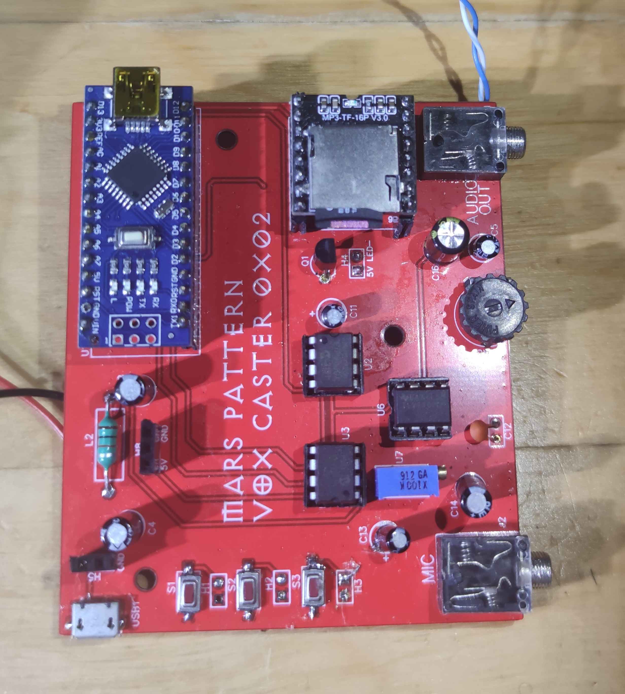
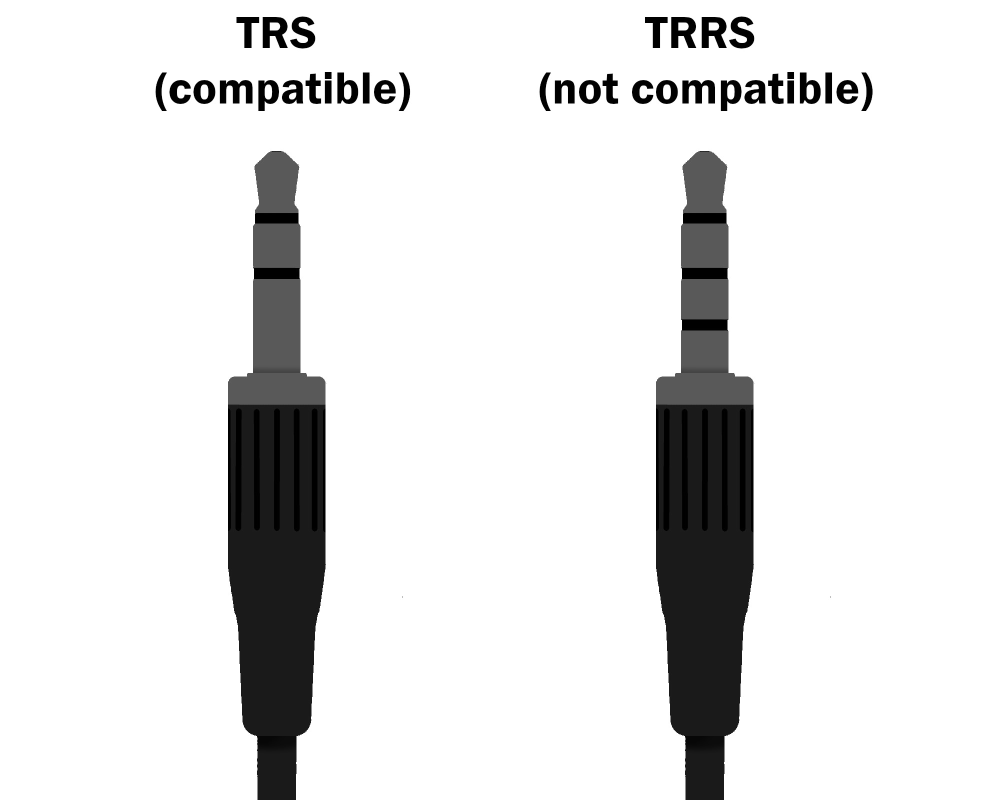

# VoxCaster
The Repo for the Mars Pattern VoxCaster (ver. 0x02), which is an Arduino Nano-based Voice Modulator.  

## Description
This project is an Arduino Nano-based voice modulator. The name "Vox Caster" is a reference to technology featured in the 40k-universe.  
In addition, there is an option to add a rudimentary soundboard based on DFRobot's DFPlayer Mini MP3 player.  
Some components may seem unusual; they were partly chosen based on what I had available at home, but should still be easy to find. 

### Demo
A quick demo can be found on YouTube, [HERE](https://www.youtube.com/watch?v=ovIH7ZAc8B0).

## Simple Quick Start
### 1. Flash the Arduino Nano using the sketch from this repo.
- Download the provided VoxCaster.ino file.
- Connect the Arduino Nano to your computer with USB.
- Open the .ino file in the Arduino IDE and select Arduino Nano - Atmega328.
- Verify that the board is recognized by the IDE (Tools → Port → (select the COM port for your Nano)) and then click "Upload". 
### 2. Assemble the bare minimum hardware.
- Build the PCB using only component from the "Required" section, skipping anything under "Optional"
- Insert the Arduino Nano into the header for U1.
### 3. Connect the audio devices.
- Connect a Lavalier-style microphone with a 3.5mm TRS connector into the MIC jack (if uncertain of the connector, check the "Microphone Selection"-section).
- Plug a battery-powered speaker with a 3.5mm TRS audio cable in the AUDIO OUT jack.
### 4. Connecting Power.
- Connect a USB Power Bank to the Arduino Nano USB Mini Port.
- If the Power bank shuts off after a few seconds, read the "Important Note" section below.
### 5. Adjust the controls
- Adjust the mic sensitivity and volume potentiometers clockwise until you’re satisfied with the sound.
- By befault, the code applies a light modulation effect automatically, so no buttons, potentiometer, or extra setup is required.

### Important Note
Without any LEDs connected, the current draw of the module varies between 30-60mA. Many modern USB power-banks have a protective feature which turns OFF the output when a too low current draw is detected (typically somewhere below 100mA). If the device appears to shut off shortly after plugging it in, this is likely what is happening. There are a few ways to avoid this:
 - Use a power bank that doesn't have this feature (typically cheaper ones should work).
 - Some power banks let you momentarily disable the shut-off when the indicator/power button is double-tapped. 
 - Plug another device that draws power into the same power bank (for example if you use other LEDs on your outfit).
 - Use a USB keep-alive device.
 - Drive some LEDs by connecting them to 5V and 0V (with resistors!), or H4 (along with Q1, read more about this under "Hardware"). One or two LEDs at 20mA each should do the trick.
 - (Brute force method) Solder a 1/4W 220Ω resistor between 5V and 0V. This should draw about ~23mA and push the total consumption closer to the required value. Repeat with more resistors if necessary, but don't choose a smaller resistance value or they might overheat.

## Using the DFPlayer Mini
As was previously stated, a simple soundboard can be added using DFRobots DFPlayerMini MP3 Player. If you want to use this, add `#define usingDFRobot` to the code. You will also need to add some audio files to a Micro SD card and plug it into the DFPlayer.  
The audio files should be placed in folders named "1" or "2", and named as 1.mp3, 2.mp3, etc.  
By default, buttons on S2 and S3 will play a sequential file from either folder "1" or "2" respectively. These can be used to play anything from a soundtrack, sounds from video-games, or pre-recorded lines.  
For example, if folder 1 contains 1.mp3, 2.mp3, and 3.mp3, pressing S2 will play file 1, then 2, then 3 in order.  
Using the DFPlayerMini requires two additional libraries, SoftwareSerial and DFRobotDFPlayerMini, ensure these are installed.  

## Hardware
Schematics, component list, and gerber files are provided here.  
The pads by S1, S2, and S3 allow you to solder 6.2mm length SPST SMD-buttons to the PCB, which connect to D4, D5, and D6. You can also use the headers H1, H2, and H3 if you would rather solder header pins and plug in loose buttons.  
Wiring a potentiometer to H8 (centre wiper) will connect it to A0 on the Nano. You can use it to alter the modulation, or anything else you would like.   
There are pads for a SMD-mounted USB Micro header, as well as a ferrite bead, should you prefer to use that instead of the Arduino Nano's USB Mini header. You can probably replace the ferrite bead with a 0 Ω resistor in a 1206-package without any noticeable issues.  
H4 is a 2-pin header that can act as a current sink, such as for driving LEDs. Adding a 2n2222 or compatible transistor to Q1 and wiring the LEDs to H4 (note the polarity!) will let you control them using D3 (PWM-enabled). This can be used to drive LEDs in synch with the speech (code for this is pending).  

NOTE1 ! H4 is NOT current-limited, make sure you wire resistors to the LEDs as you would normally. A 2n2222 can typically sink up to 600mA continuously.  
NOTE2 ! Using PWM can cause noise on the audio lines, a small capacitor across pin 1 and 3 of Q1 can reduce this slightly (keep polarity in mind if using electrolytics!).  

### Fully Populated PCB

## Components
In addition to the board-mounted components you will also need:
 - An Arduino Nano compatible board
 - A 3.5mm TRS-connector microphone (the 3-pole variety, read more under "Microphone Selection")
 - A battery-powered speaker with 3.5mm AUX input and a 3.5mm TRS audio cable. Ensure that the speaker has a 3.5mm AUX jack, not all Bluetooth speakers have one.
 
### Optional 
 - 10k Potentiometer
 - DFPlayer Mini MP3 Player + Micro SD card with audio files.

## Microphone Selection
The audio jacks listed in the component selection are compatible with 3.5mm TRS-connectors. Some microphones come with a 4-pole connector (TRRS), and these will not work. If you are uncertain, look at the below picture. 

Please do not plug line-level devices (such as an MP3-player or other audio output) into the microphone jack, it is designed for microphones, which generate voltage swings in the mV-range.  

### Microphone technical details
The microphone is driven by the 3.3V LDO on the Arduino. With `R1=4k7`, and assuming a bias voltage of 1V, the bias current will be around 490uA. This should work for most Lavalier-style microphones.  
Left and right-audio input channels are wired together.

## Software
The software is heavily based on the Audio-hacker by nootropic design.  
By default, a light modulation is applied. If you want to change this in real-time, two ways are supported: Using buttons or a potentiometer. By default, connecting a button to S1 or H1 will allow you to cycle through 9 different amounts of modulation, including one without modulation. If you connect a potentiometer to H8 and alter the code slightly you can instead use that to alter the modulation amount.  
Again, if you plan on using the DFPlayer for soundboard integration, make sure to uncomment or add  `#define usingDFRobot` into the code.   

## Theory of operation.
Audio is sampled at ~22KHz from the ADC into a buffer using Timer1 interrupts (ISR).  
Without modulation, the output to the DAC follows the buffer in sync with the input.  
When modulation is applied, the output to the DAC "lags" behind by an adjustable amount. How much it lags behind depends on `modulatorVal`.  
For example:  
A `modulatorVal` of 2 will cause the output to skip every other update. This gives the highest distortion and unrecognizable speech.  
A `modulatorVal` of 3 will skip every third update.  
`modulatorVal = 6` will skip every 6th update.  
The higher the value of `modulatorVal`, the less the output "lags" behind.  
`modulatorVal = 10` is hardcoded as no modulation (noMod = true).   

When nearing the end of the buffer, the output needs to "catch up" with the input.  
To avoid sudden differences or "pops" in the output, the real-time input and lagged output signals are mixed.

Take a look a the ISR(TIMER1_COMPA_vect) {} section of the code (after line 260) if you would like to make any modifications to the modulation scheme or similar.

## Future Plans
- Re-writing the README in High Gothic.
- Re-writing the README in Binary.
- Other modulation styles?
- Get the LED-integration working properly (adjust brightness in synch with speech). Patterns?
- Make another version of the Vox Caster with easier Minimal Setup / quickstart and better noise-immunity.
